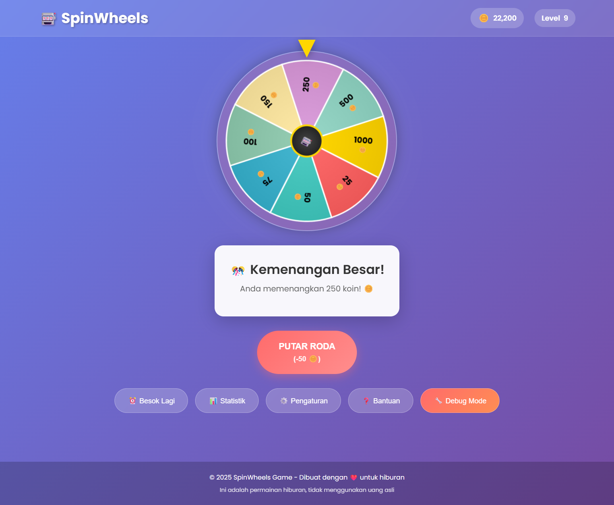
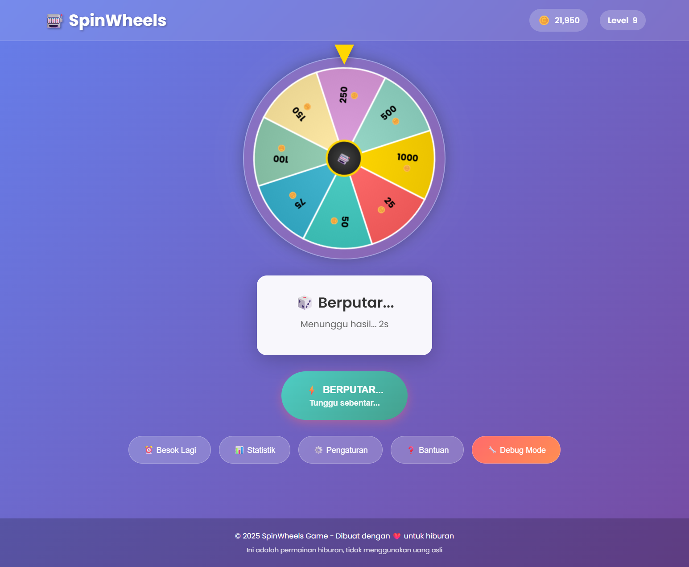
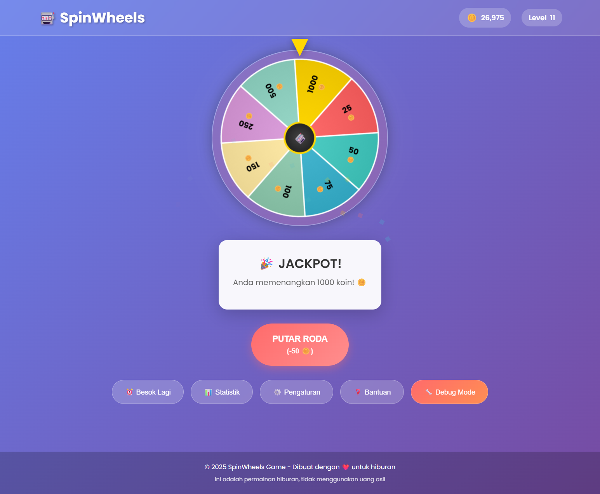
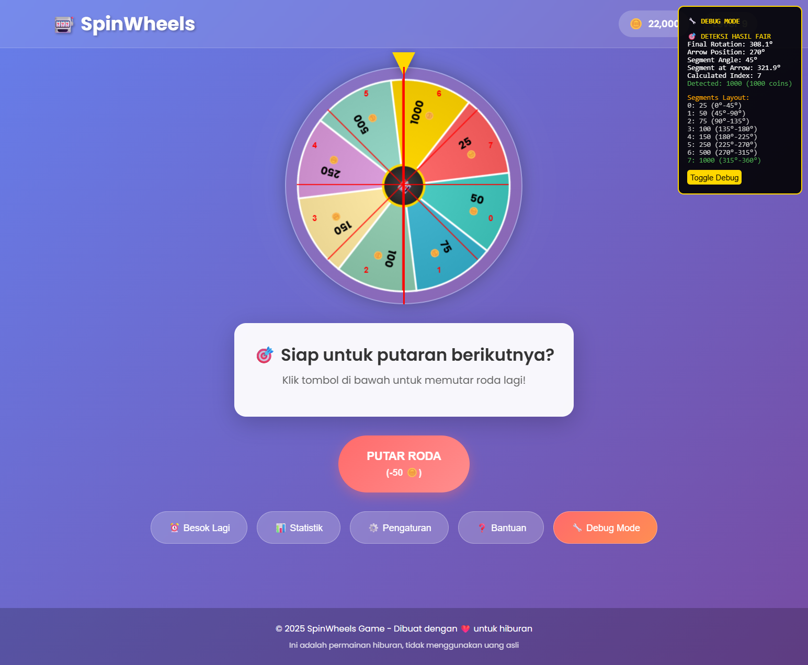

# 🚀 Panduan GitHub Release - SpinWheels Game

Panduan langkah demi langkah untuk membuat release di GitHub.

## 📋 Prerequisites

- ✅ Repository sudah dibuat di GitHub
- ✅ Code sudah di-push ke branch `main`
- ✅ Release package sudah dibuat dengan `create_release.bat` atau `python release.py`

## 🎯 Langkah-Langkah Release

### 1. 📁 Upload Code ke GitHub

```bash
# Pastikan semua file sudah di-add
git add .

# Commit dengan pesan yang jelas
git commit -m "Release v1.0.0 - SpinWheels Game dengan sistem fair"

# Push ke GitHub
git push origin main
```

### 2. 🏷️ Buat Git Tag

```bash
# Buat tag untuk versi ini
git tag v1.0.0

# Push tag ke GitHub
git push origin v1.0.0
```

### 3. 🎉 Buat GitHub Release

#### Via GitHub Web Interface:

1. **Buka repository di GitHub**
2. **Klik "Releases"** di sidebar kanan
3. **Klik "Create a new release"**
4. **Isi form release:**

```
Tag version: v1.0.0
Release title: 🎰 SpinWheels Game v1.0.0 - Game Roda Keberuntungan
```

**Description (copy paste ini):**
```markdown
# 🎰 SpinWheels Game v1.0.0

Game roda keberuntungan yang menyenangkan dengan sistem koin, level, bonus harian, dan **sistem FAIR** yang transparan!

## 🎮 Demo Live
🔗 **[MAIN SEKARANG](https://your-username.github.io/spinwheels-game)** (Update link ini setelah deploy)

## ✨ Fitur Utama

### 🎯 Gameplay
- 🎰 Roda berputar dengan 8 tingkat hadiah
- 💰 Sistem koin (50 koin per putaran)
- 📈 Level progression (naik setiap 10 putaran)
- 🎁 Bonus harian 200 koin
- 📊 Statistik lengkap dan tracking

### 🛡️ Sistem Fair & Transparansi
- ✅ **True Random** - Hasil benar-benar acak
- ✅ **Arrow-Based Detection** - Transparan dan dapat diverifikasi
- ✅ **Debug Mode** - Lihat kalkulasi secara real-time
- ✅ **No Manipulation** - Tidak ada algoritma curang

### 🎨 Interface & UX
- 📱 **Responsive Design** - Berfungsi di desktop dan mobile
- 🎮 **Keyboard Shortcuts** - SPACE (spin), H (help), S (stats), D (debug)
- 🎊 **Animasi Kemenangan** - Confetti dan efek visual
- ⚙️ **Pengaturan Lengkap** - Sound, speed, dan customization

## 🎯 Hadiah & Probabilitas

| Hadiah | Probabilitas | Deskripsi |
|--------|-------------|-----------|
| 1000 🪙 | 2% | MEGA JACKPOT |
| 500 🪙 | 5% | Jackpot kecil |
| 250 🪙 | 8% | Hadiah sangat besar |
| 150 🪙 | 10% | Hadiah besar |
| 100 🪙 | 15% | Hadiah menengah |
| 75 🪙 | 15% | Hadiah bagus |
| 50 🪙 | 20% | Hadiah umum |
| 25 🪙 | 25% | Hadiah dasar |

## 🚀 Cara Menjalankan

### Metode 1: Download & Play (Termudah)
1. Download file `SpinWheels-v1.0.0.zip`
2. Extract ke folder
3. Double-click `start_game.bat` (Windows) atau jalankan `python server.py`
4. Game otomatis terbuka di browser

### Metode 2: GitHub Pages (Online)
1. Kunjungi: https://your-username.github.io/spinwheels-game
2. Langsung main tanpa download

### Metode 3: Clone Repository
```bash
git clone https://github.com/your-username/spinwheels-game.git
cd spinwheels-game
python server.py
```

## 📸 Screenshots


*Interface utama SpinWheels dengan roda dan kontrol*


*Roda sedang berputar dengan animasi*


*Tampilan jackpot dengan efek confetti*


*Mode debug untuk transparansi sistem fair*

## 🛠️ Teknologi

- **Frontend**: HTML5, CSS3, JavaScript ES6+
- **Graphics**: Canvas API untuk rendering roda
- **Storage**: LocalStorage untuk save game
- **Server**: Python HTTP server untuk development
- **Architecture**: Modular ES6 modules

## 📋 Kompatibilitas

- ✅ Chrome 60+, Firefox 55+, Safari 11+, Edge 79+
- ✅ Desktop dan Mobile
- ✅ Touch controls untuk mobile
- ✅ Keyboard shortcuts untuk desktop

## 🤝 Kontribusi

Kami menyambut kontribusi! Lihat [CONTRIBUTING.md](CONTRIBUTING.md) untuk panduan.

## 📄 Lisensi

MIT License - Bebas digunakan untuk pembelajaran dan hiburan.

---

**🎰 Selamat bermain dan semoga beruntung! 🍀**
```

5. **Upload Assets:**
   - Drag & drop file `SpinWheels-v1.0.0.zip` ke bagian "Attach binaries"
   - Tambahkan screenshot jika diperlukan

6. **Pilih Options:**
   - ✅ Set as the latest release
   - ✅ Create a discussion for this release (optional)

7. **Klik "Publish release"**

### 4. 🌐 Setup GitHub Pages

1. **Go to repository Settings**
2. **Scroll ke "Pages" section**
3. **Source: Deploy from a branch**
4. **Branch: main / (root)**
5. **Save**

Site akan tersedia di: `https://your-username.github.io/repository-name`

### 5. 📝 Update Links

Setelah GitHub Pages aktif, update link demo di:
- Release description
- README.md
- Social media posts

## 🎯 Tips untuk Release yang Sukses

### 📸 Visual Assets
- Pastikan screenshot up-to-date
- Tambahkan GIF gameplay jika memungkinkan
- Gunakan banner atau logo yang menarik

### 📝 Description yang Menarik
- Highlight fitur utama
- Sertakan demo link yang working
- Tambahkan screenshot dan video
- Jelaskan cara install/play yang mudah

### 🏷️ Tags yang Tepat
- Gunakan semantic versioning (v1.0.0)
- Tag yang descriptive
- Consistent dengan version di package.json

### 📊 Post-Release
- Share di social media
- Submit ke game directories
- Collect feedback dari users
- Monitor analytics dan performance

## 🔗 Resources

- **📖 Dokumentasi Lengkap**: [README.md](README.md)
- **🚀 Panduan Deployment**: [DEPLOYMENT.md](DEPLOYMENT.md)
- **🤝 Kontribusi**: [CONTRIBUTING.md](CONTRIBUTING.md)
- **🔒 Security**: [SECURITY.md](SECURITY.md)

---

**🎉 Selamat! SpinWheels Game Anda sekarang live di GitHub! 🎊** 