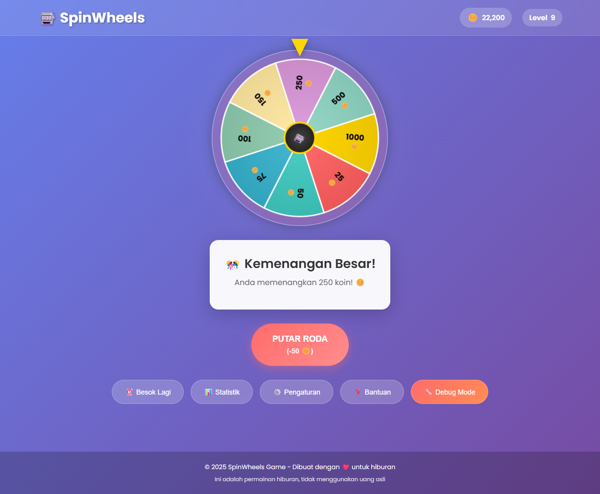
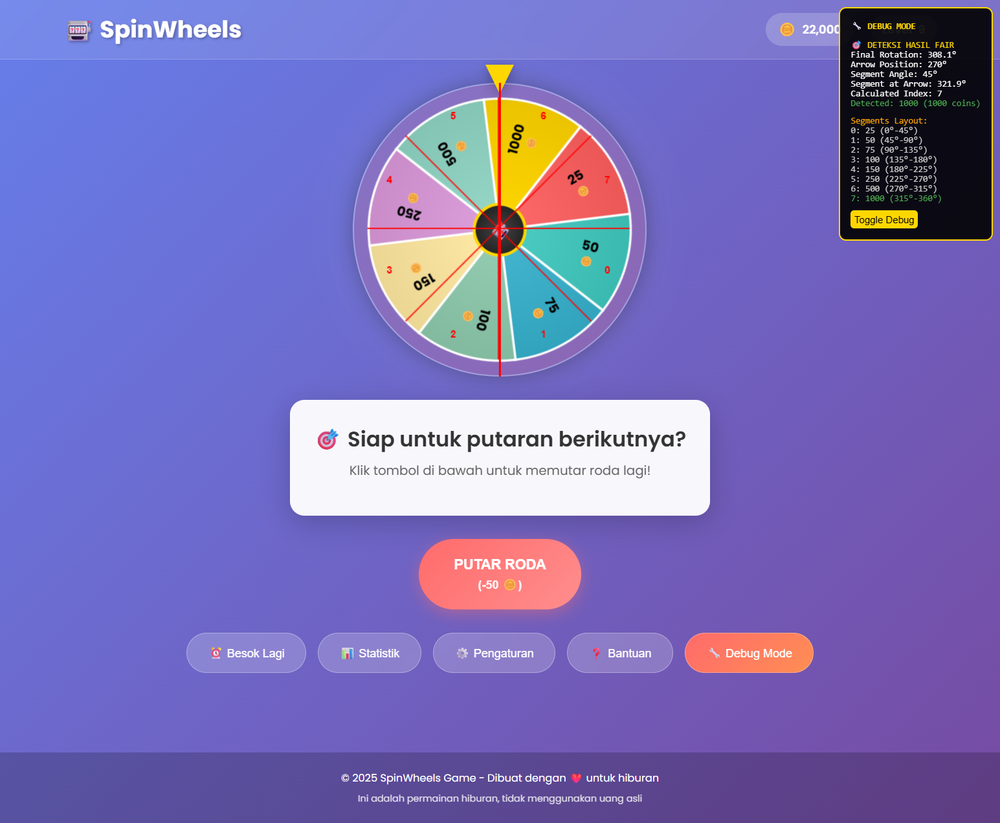

# 🎰 SpinWheels - Game Roda Keberuntungan

Game roda keberuntungan yang menyenangkan dengan sistem koin, level, bonus harian, dan **sistem FAIR** yang transparan!

## 🚀 Cara Menjalankan Game

### Metode 1: Menggunakan Batch File (Termudah)

1. **Double-click file `start_game.bat`**
2. **Game akan otomatis terbuka** di browser Anda
3. **Mulai bermain!**

### Metode 2: Menggunakan Server Python (Direkomendasikan)

1. **Pastikan Python terinstall** di komputer Anda
2. **Buka Command Prompt/Terminal** di folder game ini
3. **Jalankan server:**
   ```bash
   python server.py
   ```
4. **Game akan otomatis terbuka** di browser Anda di `http://localhost:8000`
5. **Untuk menghentikan server:** Tekan `Ctrl+C`

### Metode 3: Menggunakan Live Server (VS Code)

1. **Install extension "Live Server"** di VS Code
2. **Buka folder project** di VS Code
3. **Klik kanan pada `index.html`**
4. **Pilih "Open with Live Server"**

### Metode 4: Menggunakan HTTP Server Lain

```bash
# Node.js (jika terinstall)
npx http-server

# Python 3
python -m http.server 8000

# PHP (jika terinstall)
php -S localhost:8000
```

## 📸 Screenshot Game

### 🎯 Tampilan Awal Game

*Interface utama SpinWheels dengan roda, kontrol, dan informasi pemain*

### 🎮 Saat Bermain

*Roda sedang berputar dengan animasi dan feedback visual yang menarik*

### 🎉 Jackpot Mode

*Tampilan saat mendapat jackpot dengan efek confetti dan animasi kemenangan*

### 🔧 Debug Mode

*Mode debug yang menampilkan garis pembagi segment dan informasi teknis untuk transparansi sistem fair*

## 🎮 Cara Bermain

- **🎯 Tujuan:** Putar roda untuk memenangkan koin!
- **💰 Biaya:** 50 koin per putaran
- **🎁 Bonus Harian:** Klaim setiap hari untuk mendapat 200 koin gratis
- **📈 Level:** Naik setiap 10 putaran
- **🎲 Sistem Fair:** Hasil ditentukan oleh posisi arrow yang sebenarnya

### Kontrol Game

- **SPACE** - Putar roda
- **H** - Buka bantuan
- **S** - Buka statistik
- **D** - Toggle debug mode
- **Mouse/Touch** - Klik tombol untuk bermain

## 🛠️ Masalah yang Diperbaiki

### 1. HTML Syntax Error
- **Masalah:** Tag `</style>` tanpa pembuka di `index.html`
- **Solusi:** Menghapus tag yang tidak perlu

### 2. Missing Import
- **Masalah:** File `ui.js` menggunakan `GAME_CONFIG` tanpa import
- **Solusi:** Menambahkan `import GAME_CONFIG from './config.js'`

### 3. ES6 Modules CORS Issue
- **Masalah:** Browser memblokir ES6 modules saat dibuka dengan `file://`
- **Solusi:** Menyediakan HTTP server untuk development

### 4. Port Already in Use Error
- **Masalah:** Error `[WinError 10048]` saat port 8000 sudah digunakan
- **Solusi:** Server otomatis mendeteksi dan memberikan instruksi alternatif

## 📁 Struktur Project

```
SpinWheels/
├── index.html          # File HTML utama dengan UI lengkap
├── server.py           # Server HTTP dengan CORS support
├── start_game.bat      # Script Windows untuk memulai game
├── CARA_MAIN.txt       # Panduan singkat cara bermain
├── README.md           # Dokumentasi lengkap (file ini)
├── js/                 # Modul JavaScript (ES6 modules)
│   ├── main.js         # Entry point & event listeners
│   ├── gameLogic.js    # Logika permainan & sistem fair
│   ├── wheel.js        # Rendering roda dengan Canvas API
│   ├── ui.js           # Interface pengguna & DOM manipulation
│   ├── gameData.js     # Manajemen data & localStorage
│   ├── config.js       # Konfigurasi game & probabilitas
│   ├── bonus.js        # Sistem bonus harian
│   ├── settings.js     # Pengaturan game & preferences
│   ├── modals.js       # Modal dialogs & popup management
│   └── animations.js   # Animasi confetti & efek visual
├── styles/             # File CSS modular
│   ├── main.css        # Style utama & layout
│   ├── wheel.css       # Style roda & canvas
│   ├── controls.css    # Style tombol & kontrol
│   ├── animations.css  # Animasi CSS & transitions
│   ├── modals.css      # Style modal & dialog
│   └── responsive.css  # Responsive design & mobile
└── screenshot/         # Screenshot game untuk dokumentasi
    ├── first.png       # Tampilan awal game
    ├── playing.png     # Gameplay saat roda berputar
    ├── jakpot.png      # Tampilan jackpot dengan confetti
    └── debug_mode.png  # Mode debug dengan visualisasi
```

## 🎨 Fitur Game Lengkap

### ✅ Sistem Permainan
- **Roda Berputar Animasi** - Canvas HTML5 dengan animasi CSS smooth
- **Sistem Koin** - Earn dan spend koin untuk bermain
- **Level System** - Progress tracking dengan level otomatis
- **Bonus Harian** - Klaim bonus 200 koin setiap hari
- **Statistik Lengkap** - Track semua progress dan achievement
- **Local Storage** - Progress tersimpan otomatis di browser

### ✅ Sistem Fair & Transparansi
- **True Random Rotation** - Rotasi benar-benar acak tanpa manipulasi
- **Arrow-Based Detection** - Hasil ditentukan oleh posisi arrow yang sebenarnya
- **Debug Mode** - Visualisasi pembagian segment dan deteksi hasil
- **No Predetermined Results** - Tidak ada hasil yang ditentukan sebelumnya
- **Real-time Verification** - Verifikasi hasil secara real-time

### ✅ Interface & UX
- **Responsive Design** - Berfungsi optimal di desktop dan mobile
- **Modern UI** - Design yang clean dan user-friendly
- **Keyboard Shortcuts** - Kontrol cepat dengan keyboard
- **Modal System** - Dialog untuk statistik, bantuan, dan pengaturan
- **Visual Feedback** - Animasi dan efek untuk setiap aksi

### ✅ Animasi & Efek
- **Confetti Effects** - Animasi kemenangan yang bervariasi
- **Win Animations** - Efek visual untuk berbagai tingkat kemenangan
- **Smooth Transitions** - Transisi yang halus antar state
- **Background Effects** - Perubahan background untuk jackpot

### ✅ Pengaturan & Customization
- **Sound Toggle** - Kontrol efek suara
- **Animation Speed** - Pilihan kecepatan animasi (Lambat/Normal/Cepat)
- **Confetti Toggle** - Kontrol efek confetti
- **Game Reset** - Reset semua progress dengan konfirmasi

### ✅ Debug & Development
- **Debug Mode** - Visualisasi teknis untuk verifikasi
- **Console Logging** - Log detail untuk debugging
- **Error Handling** - Penanganan error yang robust
- **Fallback Systems** - Sistem cadangan untuk edge cases

### ✅ Visual Preview & Documentation
- **Screenshot Gallery** - Preview visual semua fitur game
- **Interactive Demo** - Lihat gameplay dalam action
- **Debug Visualization** - Transparansi sistem fair dengan visual
- **UI/UX Showcase** - Demonstrasi interface yang responsive

## 🎯 Hadiah Roda & Probabilitas

| Hadiah | Probabilitas | Warna | Deskripsi |
|--------|-------------|-------|-----------|
| 25 🪙  | 25%         | Merah | Hadiah dasar |
| 50 🪙  | 20%         | Teal  | Hadiah umum |
| 75 🪙  | 15%         | Biru  | Hadiah bagus |
| 100 🪙 | 15%         | Hijau | Hadiah menengah |
| 150 🪙 | 10%         | Kuning| Hadiah besar |
| 250 🪙 | 8%          | Ungu  | Hadiah sangat besar |
| 500 🪙 | 5%          | Mint  | Jackpot kecil |
| 1000 🪙| 2%          | Emas  | MEGA JACKPOT |

**Total Probabilitas:** 100% (Sistem fair dengan distribusi yang seimbang)

## 🔧 Teknologi & Implementasi

### Frontend Technologies
- **HTML5** - Struktur semantic dengan accessibility
- **CSS3** - Styling modular dengan Flexbox/Grid
- **JavaScript ES6+** - Modules, async/await, modern syntax
- **Canvas API** - Rendering roda dan animasi
- **LocalStorage API** - Persistensi data lokal

### Architecture Patterns
- **Modular Design** - Pemisahan concern yang jelas
- **ES6 Modules** - Import/export untuk dependency management
- **Event-Driven** - Event listeners dan custom events
- **State Management** - Centralized game state
- **Responsive Design** - Mobile-first approach

### Development Tools
- **Python HTTP Server** - Development server dengan CORS
- **Batch Scripts** - Windows automation
- **Console Debugging** - Comprehensive logging
- **Error Handling** - Graceful error recovery

## 🔧 Troubleshooting

### Game Tidak Bisa Dimuat
- ✅ Pastikan menjalankan dengan HTTP server (bukan double-click HTML)
- ✅ Check console browser untuk error messages
- ✅ Pastikan semua file ada di tempatnya
- ✅ Gunakan `start_game.bat` untuk kemudahan
- ✅ Lihat screenshot `first.png` untuk referensi tampilan yang benar

### Roda Tidak Berputar
- ✅ Pastikan ada cukup koin (minimal 50)
- ✅ Check apakah sedang dalam proses spinning
- ✅ Refresh halaman jika stuck
- ✅ Aktifkan debug mode untuk troubleshooting
- ✅ Bandingkan dengan screenshot `playing.png` untuk gameplay normal

### Data Hilang
- ✅ Data tersimpan di localStorage browser
- ✅ Jangan clear browser data jika ingin keep progress
- ✅ Gunakan fitur reset di pengaturan jika diperlukan

### Port Already in Use
- ✅ Tutup instance server yang lain
- ✅ Gunakan port alternatif: `python server.py 8001`
- ✅ Check browser di `http://localhost:8000` jika server sudah jalan

### Debug Mode Issues
- ✅ Tekan tombol "Debug Mode" atau tekan `D`
- ✅ Lihat console browser untuk log detail
- ✅ Verifikasi posisi arrow dengan garis merah
- ✅ Check pembagian segment dengan nomor
- ✅ Referensi visual: lihat screenshot `debug_mode.png`

### Visual Issues
- ✅ Pastikan semua file CSS termuat dengan benar
- ✅ Check network tab di developer tools
- ✅ Bandingkan tampilan dengan screenshot di folder `screenshot/`
- ✅ Refresh browser jika ada masalah rendering

## 📱 Kompatibilitas

### Desktop Browsers
- ✅ **Chrome** 60+ (Optimal)
- ✅ **Firefox** 55+ (Optimal)
- ✅ **Safari** 11+ (Optimal)
- ✅ **Edge** 79+ (Optimal)

### Mobile Browsers
- ✅ **iOS Safari** 11+ (Touch optimized)
- ✅ **Chrome Mobile** 60+ (Touch optimized)
- ✅ **Samsung Internet** 8+ (Touch optimized)
- ✅ **Firefox Mobile** 55+ (Touch optimized)

### Features Support
- ✅ **ES6 Modules** - Required
- ✅ **Canvas API** - Required
- ✅ **LocalStorage** - Required
- ✅ **CSS Animations** - Required
- ✅ **Touch Events** - Mobile support

## 🎲 Sistem Fair Explanation

### Bagaimana Sistem Fair Bekerja

1. **Random Rotation Generation**
   - Rotasi dihasilkan secara acak (720° - 2160°)
   - Tidak ada predeterminasi hasil
   - Menggunakan `Math.random()` yang sebenarnya

2. **Arrow-Based Detection**
   - Arrow tetap di posisi atas (270°)
   - Hasil ditentukan oleh segment yang berada di posisi arrow
   - Kalkulasi matematis yang transparan

3. **Real-time Verification**
   - Debug mode menampilkan kalkulasi secara real-time
   - Garis merah menunjukkan posisi arrow
   - Nomor segment untuk verifikasi

4. **No Manipulation**
   - Tidak ada algoritma yang mengubah hasil
   - Probabilitas sesuai dengan konfigurasi
   - Transparansi penuh dalam proses

### Verifikasi Sistem Fair

```javascript
// Contoh kalkulasi deteksi hasil
const segmentAngle = 360 / 8; // 45° per segment
const arrowPosition = 270; // Arrow di atas
const finalRotation = 1234; // Contoh rotasi final
const normalizedAngle = finalRotation % 360;
const segmentAtArrow = (arrowPosition - normalizedAngle + 360) % 360;
const segmentIndex = Math.floor(segmentAtArrow / segmentAngle);
```

## 🤝 Kontribusi & Development

### Untuk Developer
- **Fork** repository ini
- **Clone** ke local machine
- **Jalankan** dengan `python server.py`
- **Edit** file sesuai kebutuhan
- **Test** di berbagai browser
- **Submit** pull request

### Struktur Code
- **Modular Architecture** - Setiap fitur dalam file terpisah
- **Clean Code** - Naming convention yang jelas
- **Documentation** - Comment yang comprehensive
- **Error Handling** - Robust error management

### Testing Guidelines
- Test di berbagai browser dan device
- Verifikasi sistem fair dengan debug mode
- Check responsive design di mobile
- Validate localStorage functionality

### Screenshot & Documentation
- **Visual Testing** - Bandingkan hasil dengan screenshot referensi
- **UI Consistency** - Pastikan tampilan sesuai dengan `first.png`
- **Feature Verification** - Gunakan `debug_mode.png` untuk verifikasi sistem fair
- **Gameplay Testing** - Referensi `playing.png` dan `jakpot.png` untuk flow normal
- **Update Screenshots** - Perbarui screenshot jika ada perubahan UI signifikan

### Development Workflow
1. **Setup** - Jalankan server lokal
2. **Code** - Edit file sesuai kebutuhan
3. **Test** - Verifikasi dengan screenshot referensi
4. **Debug** - Gunakan debug mode untuk troubleshooting
5. **Document** - Update screenshot jika diperlukan
6. **Submit** - Create pull request dengan dokumentasi

## 📄 Lisensi & Credits

**Dibuat dengan ❤️ untuk hiburan dan pembelajaran**

- 🎮 **Game Type:** Browser-based wheel spinning game
- 🔧 **Technology:** Vanilla JavaScript, HTML5, CSS3
- 🎯 **Purpose:** Entertainment & educational
- 💰 **Monetization:** None (tidak menggunakan uang asli)
- 📜 **License:** Open source untuk pembelajaran

### Acknowledgments
- **Canvas API** untuk rendering roda
- **CSS Animations** untuk efek visual
- **LocalStorage** untuk persistensi data
- **Python HTTP Server** untuk development

---

**🎰 Selamat bermain dan semoga beruntung! 🍀**

*Game ini menggunakan sistem FAIR yang transparan - hasil benar-benar ditentukan oleh keberuntungan Anda!* 